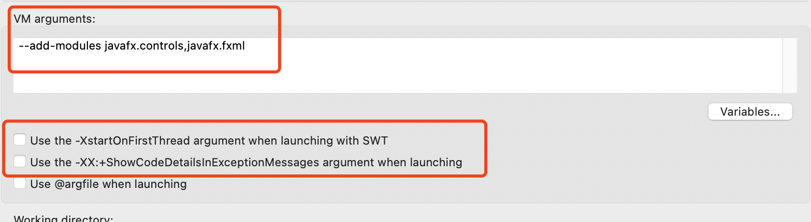

# Smart-Splitter

##### After importing this project into Eclipse. We should set up the configuration first.

1. Click on the run as -> run configurations. Then create a new configuration for this project Main.java

2. After that, set VM arguments to "--add-modules javafx.controls,javafx.fxml" and unchoose the choices shown below, then you can run the application perfectly!

##### Because of the lack of databases, we have to mock data into the system. Therefore, during using, please make sure you have "chen" into your payers. Also, make sure you type in payers in the format: "name1, name2, name3, ..."